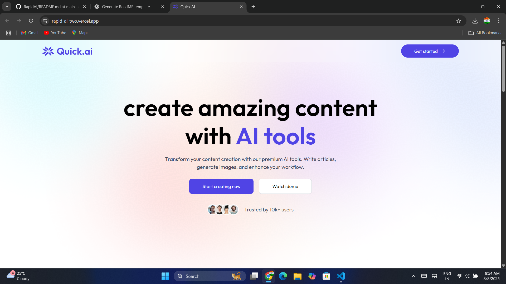
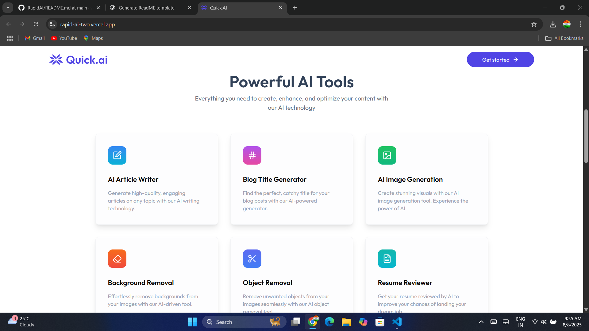
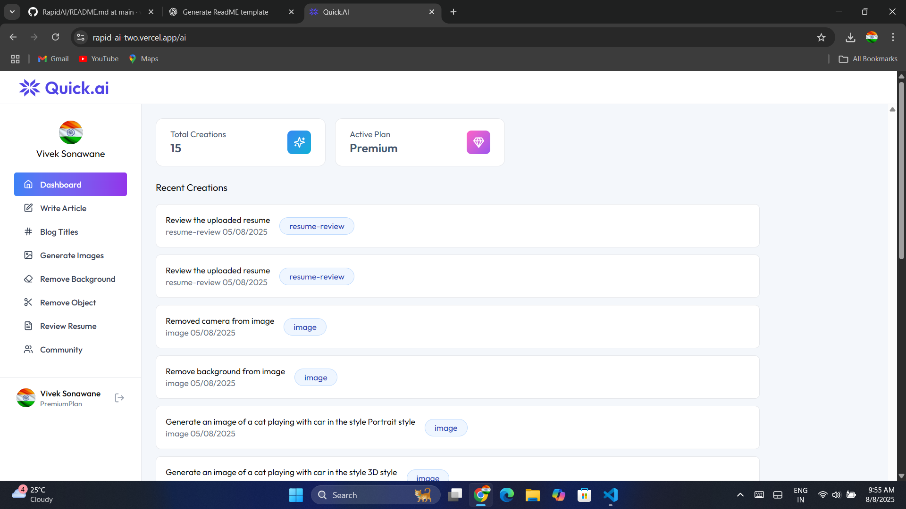
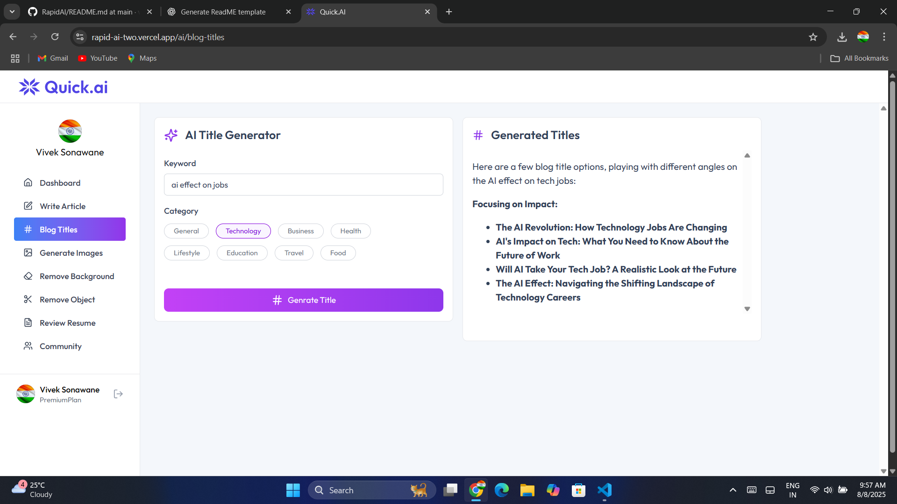
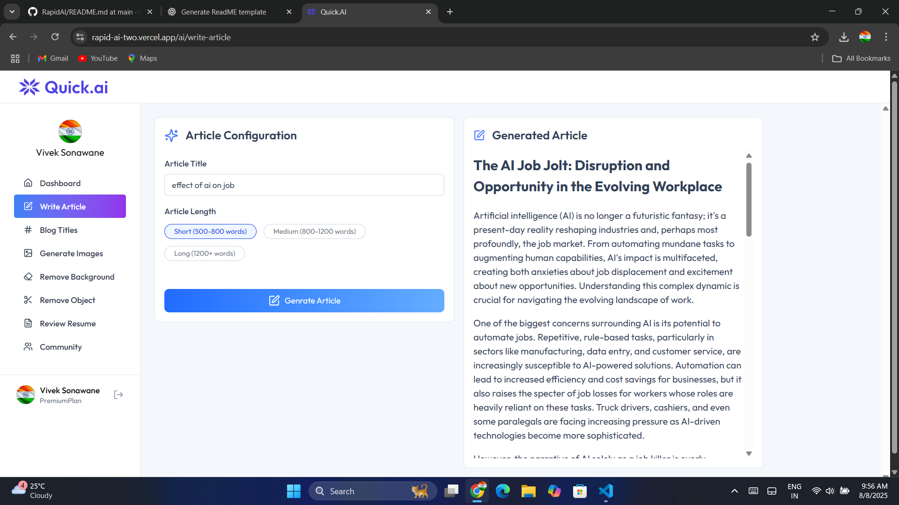
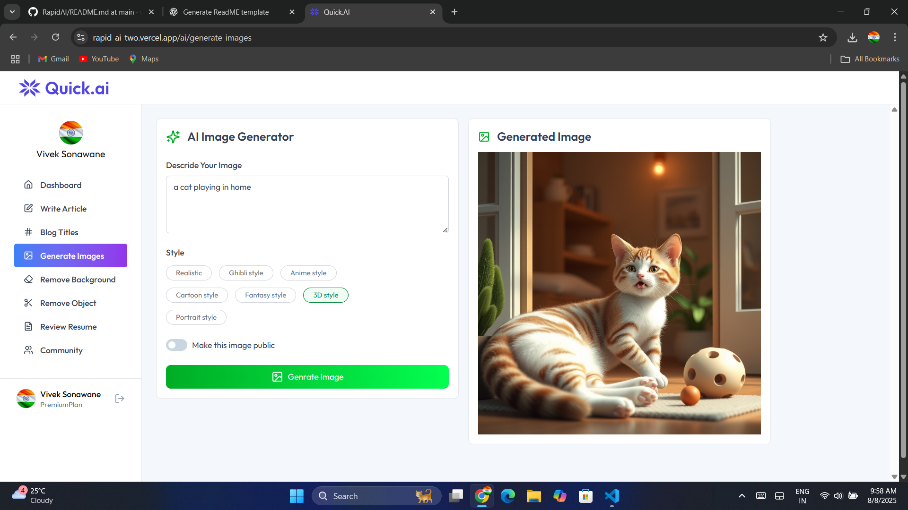
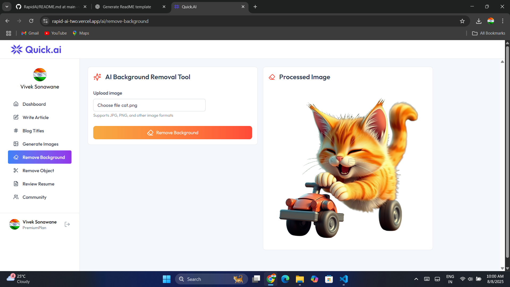
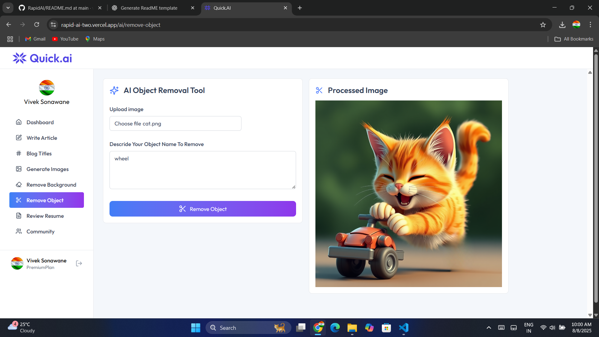
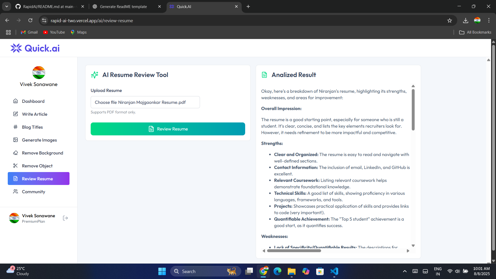
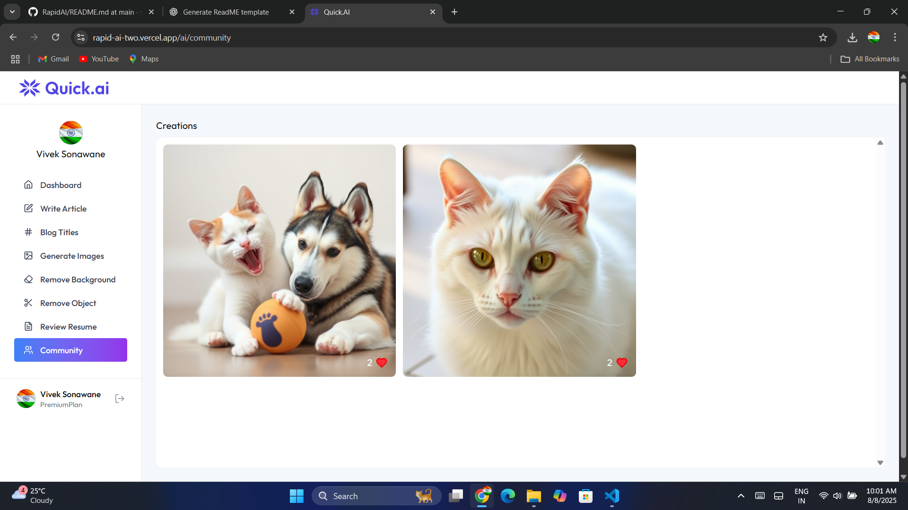

# **QuickAI**

QuickAI is a **Software as a Service (SaaS)** platform powered by AI, offering tools for content creation, image editing, and professional document review — all in one place.


## 🚀 Features
- **Blog Title Generation** – Get catchy and SEO-friendly blog titles.
- **Article Generation** – Create high-quality, AI-generated articles in seconds.
- **Image Generation** – Generate images from text prompts.
- **Background Removal** – Remove image backgrounds instantly.
- **Object Removal** – Erase unwanted objects from images.
- **Resume Review** – AI-powered resume suggestions for better job opportunities.
- **Community** – Upload your creations on community.

## 🛠 Tech Stack
- **Frontend:** React.js
- **Backend:** Express.js (Node.js)
- **Bundler Tool:** VITE
- **Database:** PostgreSQL
- **AI Models:** Gemini API,ClipDrop API
- **Hosting:** Vercel

## 📦 Installation

```bash
# Clone the repository
git clone https://github.com/vivekWeb7812/RapidAI.git

# Go into the project folder
cd RapidAI

# Install dependencies for client
cd client
npm install

# Install dependencies for server
cd ../server
npm install
```

## ⚙️ Environment Variables
Create a `.env` file in the `client` folder and add:

```

VITE_CLERK_PUBLISHABLE_KEY="provide_your_key"

VITE_BASE_URL=http://localhost:3000

```

Create a `.env` file in the `server` folder and add:

```

DATABASE_URL ="provide_your_db_url"
CLERK_PUBLISHABLE_KEY="provide_your_key"
CLERK_SECRET_KEY="provide_your_key"
GEMINI_API_KEY="provide_your_key"
CLIPDROP_API_KEY="provide_your_key"

CLOUDINARY_CLOUD_NAME="provide_name"
CLOUDINARY_API_KEY="provide_your_key"
CLOUDINARY_API_SECRET="provide_your_key"

```

## ▶️ Usage
```bash
# Start backend
cd server
npm run dev

# Start frontend
cd ../client
npm run server
```

Access the app at: `http://localhost:3000`

## ▶️ UI Design























## 📜 License
This project is licensed under the **MIT License** – you are free to use, modify, and distribute it.
